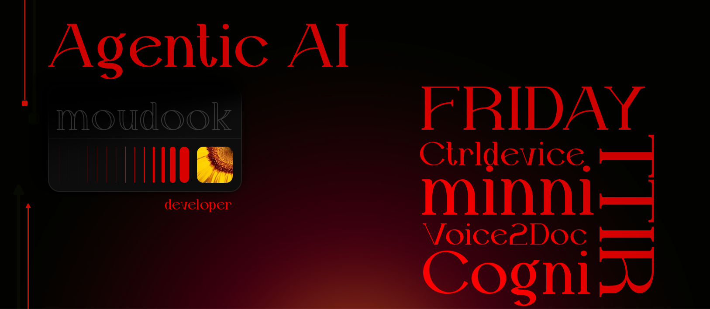

# moudook

[;%7Cwhile(alive)+%7B+build_the_future();+%7D%7Cai.declutter_minds(mode=%22Intelligent%22);%7C%3E%3E+STATUS:+Orchestrating_Devices...)](https://git.io/typing-svg)

  
  
  
  

---

### 🔱 The Forge of Agents
I build autonomous entities that bridge the gap between human ideation and device execution. My work focuses on **high-level agentic orchestration**, **behavioral analysis**, and **intelligent automation**.

## Top Projects Showcase

<table width="100%">
  <tr>
    <td width="50%" valign="top">
      <h3><a href="https://github.com/moudook/App_dev">App_dev</a> (Agentic Companion)</h3>
      
<i>The "Supercharged Mind" Companion</i>

      <ul>
        <li><b>Proactive Management:</b> Intelligent calendar & meeting orchestration.</li>
        <li><b>Deep Research:</b> Autonomous workflows for supercharged ideation.</li>
        <li><b>Privacy-First:</b> Unique "Shake-to-Private" mode for instant security.</li>
      </ul>
      
      
    </td>
    <td width="50%" valign="top">
      <h3><a href="https://github.com/moudook/ctrldevice">CtrlDevice</a> (Droid-Controller)</h3>
      
<i>Autonomous Device Orchestration</i>

      <ul>
        <li><b>Zero Intervention:</b> Agent operates device tasks independently.</li>
        <li><b>Native Level:</b> Deep integration with Android system layers.</li>
        <li><b>Flexible Execution:</b> Real-time response to high-level natural language.</li>
      </ul>
       
       
    </td>
  </tr>
  <tr>
    <td colspan="2" valign="top">
      <h3><a href="https://github.com/moudook/behaviour_analyzer">Behaviour_Analyzer</a> (Cogni-Engine)</h3>
      
<i>Decoding human-device interaction patterns for cognitive decluttering.</i>

      

        
        
        
      

    </td>
  </tr>
</table>

---

## Technical Arsenal

<table width="100%">
  <tr>
    <td width="25%" align="center"><b>Core Languages</b></td>
    <td>
      
    </td>
  </tr>
  <tr>
    <td width="25%" align="center"><b>Mobile & Agentic</b></td>
    <td>
      
      
      
      
    </td>
  </tr>
  <tr>
    <td width="25%" align="center"><b>Tools & IDEs</b></td>
    <td>
      
      
      
    </td>
  </tr>
  <tr>
    <td width="25%" align="center"><b>Specializations</b></td>
    <td>
      
      
    </td>
  </tr>
</table>

### Currently Tinkering With
- **AI Deployment** & Optimization
- **Behavioral Analysis** for Intelligent Agents
- **Deep Research Workflows** for autonomous entities

 

  <table width="100%">
    <tr>
      <td width="55%" align="center" valign="top">
        
      </td>
      <td width="45%" align="center" valign="top">
        
      </td>
    </tr>
  </table>

 

  

---

## 📂 Project Registry
A curated list of my active developments and experiments.

<table width="100%">
  <tr>
    <td width="33%" valign="top">
      <h4> Agents & AI(advance)</h4>
      <ul>
        <li><a href="https://github.com/moudook/Voice2Doc">Voice2Doc</a></li>
        <li><a href="https://github.com/moudook/App_dev">Friday</a></li>
        <li><a href="https://github.com/moudook/DIFFUSION_LM">Garuda - 1</a></li>
      </ul>
    </td>
    <td width="33%" valign="top">
      <h4> Frameworks & Systems(advance)</h4>
      <ul>
        <li><a href="https://github.com/moudook/minni">Minni</a> (Edge AI)</li>
        <li><a href="https://github.com/moudook/minimalist_version">Minimalist Framework</a></li>
        <li><a href="https://github.com/moudook/TTIR">TTIR</a></li>
      </ul>
    </td>
    <td width="33%" valign="top">
      <h4> Apps & Insights</h4>
      <ul>
        <li><a href="https://github.com/moudook/Whealth">Whealth</a></li>
        <li><a href="https://github.com/moudook/EDA">EDA Library</a></li>
        <li><a href="https://github.com/moudook/Iris_flower_classification">Iris Classifiers</a></li>
      </ul>
    </td>
        <td width="33%" valign="top">
      <h4> Fully vibe coded macro tools</h4>
      <ul>
      <li><a href="https://github.com/moudook/scAI">scAI</a></li>
        <li><a href="https://github.com/moudook/Brainstorming-Chat-bot">Brainstorming-Bot</a></li>
        <li><a href="https://github.com/moudook/AI-code-editor-modified">Modified AI Editor</a></li>
        <li><a href="https://github.com/moudook/vibrant-dialogue-studio">Vibrant Dialogue Studio</a></li>
      </ul>
    </td>
  </tr>
</table>

---

## Connect & Collaborate

  

---

  "Simplicity is the ultimate System." —<i>moudook</i>

